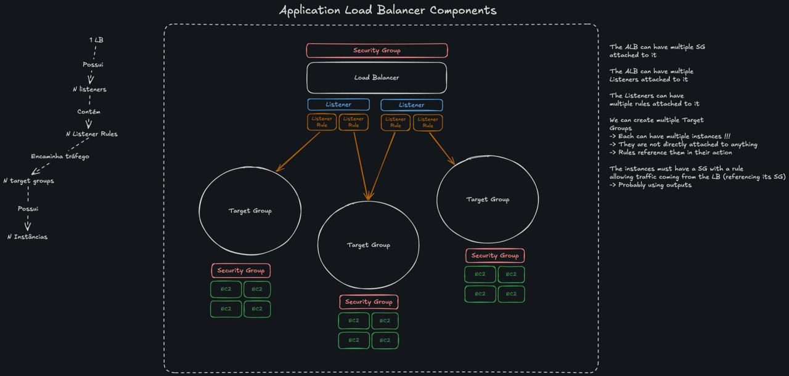

## Terraform Project

#### Lembrar
- Ao criar a zona de DNS precisamos mudar manualmente onde compramos o DNS os nameservers

#### Dúvidas
- Como vou adicionar o SG permitindo comunicação do ALB para as VMs?

#### Adicionar ao LB Module
-> Adicionar esses abaixo no ALB

- health_check_logs - (Optional) Health Check Logs block. See below. Only valid for Load Balancers of type application.

- connection_logs - (Optional) Connection Logs block. See below. Only valid for Load Balancers of type application.

- access_logs - (Optional) Access Logs block. See below.

-> Adicionar ao Listener depois (para ter TLS)

- certificate_arn - (Optional) ARN of the default SSL server certificate. Exactly one certificate is required if the protocol is HTTPS. For adding additional SSL certificates, see the aws_lb_listener_certificate resource.

- ssl_policy - (Optional) Name of the SSL Policy for the listener. Required if the protocol is HTTPS or TLS. Default is ELBSecurityPolicy-2016-08.

#### LB MODULE

- [x] LOAD BALANCER
- [ ] LISTENERS + RULES
- [ ] TARGET GROUP
- [x] SECURITY GROUP (LB <- INTERNET)
- [ ] SECURITY GROUP (TARGET GROUP <- LB)